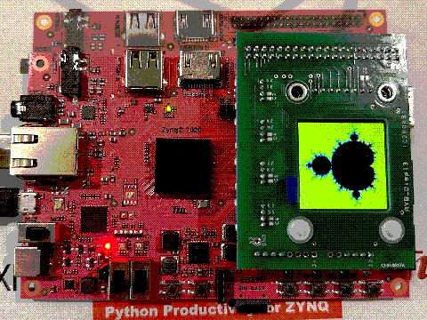

# PYNQ Mandelbrot

This is a simple demonstration of how to work with a display module on the
PYNQ-Z2 board. 

This program is written using TU Eindhoven’s 
[libpynq](https://pynq.tue.nl/5ewc0/libpynq/) library.



## Instructions

The Makefile for this program has been written in such a way as to cross compile
from a separate machine and transfer to the PYNQ-board.

Because this is mostly intended as a demo, you might want to configure the build
before running `make`. 

In broad terms, steps to build are as follows:

1. Make sure you have a compiled version of `libpynq` from TU/e.
   + The compiled library is expected at __../../libpynq/lib/libpynq.a__
   + Headers are expected at __../../libpynq/include/…__
   + Change the `LIBRARIES` variable in `Makefile` if necessary.

2. Make sure you have a sysroot from the PYNQ board.
   + You can ssh into the PYNQ-board and archive `/lib /usr/include /usr/lib /usr/local/lib /usr/local/include`
   + The sysroot is expected at __../../sysroot__
   + Change the `SYSROOT` variable in `Makefile` if necessary.

3. Make sure you have a compiler and linker that supports the PYNQ-board
   + The target triple for PYNQ-Z2 is `arm-linux-gnueabihf`
   + I had success with Apple `clang` bundled with Xcode and and `lld` installed with Homebrew. 
   + In Makefile, clang is told to use lld for linking with `fuse-ld=lld`

4. Compile
   + Run `make` in order to compile.
   + Object files are put into __build/artifacts__
   + The output program is put into __build/bin__

5. Install to PYNQ-board
   + Run `make install` to copy with scp. 
   + Requires that PYNQ is connected with an ethernet cable
   + Requires `sshpass` to give password to scp.
   + Set `INSTALL_USER` and `INSTALL_PASSWORD` if necessary

## Editing source code in VS Code

For code completion, error checking and navigation I recommend using the `clangd` extension in VS Code.

You can add a __.clangd__ file in the project root specifying where to find the libpynq headers like so:

```yaml
CompileFlags:
  Add:
    - "-I/Users/.../Projects/PYNQ/libpynq/include"
```